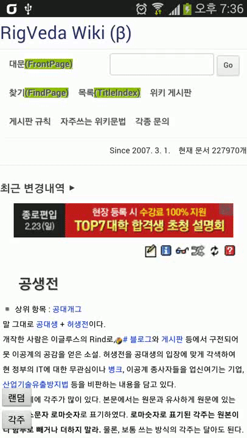

RigVedaViewer
=============

RigVedaViewer is Android webview application for RigVeda Wiki

리그베다 뷰어는 리그베다 위키를 더 편하게 볼 수 있게 해주는 앱입니다.

- 글 곳곳에 추가되어 있는 주석을 우측 슬라이드 메뉴에 모아 보여줍니다.
- 실제링크와 표시되는 문장이 다른 "링크 드립"의 경우, 해당 글자의 오른쪽에 별도로 출력해 줍니다.
- 상단의 불필요한 메뉴를 제거한 상태로 보여줍니다.

리그베다 뷰어 [웹사이트][1]를 방문하시면 더 상세한 정보를 얻으실 수 있습니다. 
For more information please see [the website][1]

### Download app

 [1]: http://stanleykou.tistory.com/category/%EB%A6%AC%EA%B7%B8%EB%B2%A0%EB%8B%A4%EB%B7%B0%EC%96%B4
 
